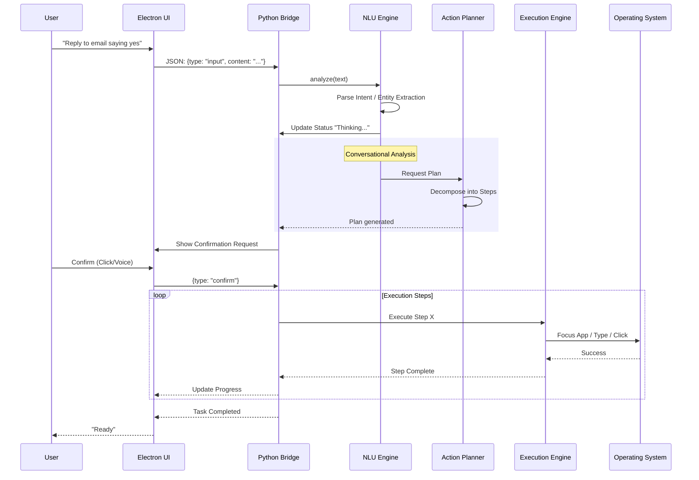
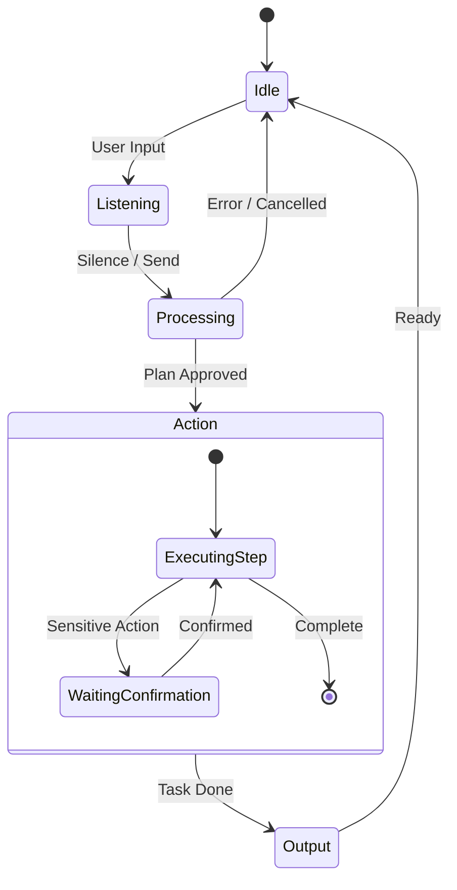

# Maes Technical Architecture Flowchart

This document outlines the technical architecture and data flow of the **Maes** accessibility operating layer.

## System Overview

Maes consists of two primary processes communicating via local standard I/O (stdio):
1.  **Frontend (Electron)**: Handles UI, voice capture, and OS integration (overlay windows).
2.  **Backend (Python)**: Handles NLU, logic, planning, and OS automation execution.

```mermaid
graph TD
    subgraph Frontend [Electron Frontend]
        UI[Renderer UI\n(HTML/JS)] <-->|IPC| Main[Main Process\n(Node.js)]
    end

    subgraph Backend [Python Backend]
        Bridge[Desktop Bridge\n(desktop_bridge.py)]
        Runtime[Maes Runtime\n(Orchestrator)]
        
        subgraph Intelligence [NLU & Planning]
            NLU[NLU Engine]
            Planner[Action Planner]
            LLM[LLM Brain\n(OpenAI/Anthropic)]
        end
        
        subgraph Execution [Execution & Control]
            Executor[Execution Engine]
            OS[OS Control\n(Keyboard/Mouse)]
            Browser[Browser Agent]
        end
        
        subgraph Context [State & Safety]
            Session[Session Context]
            Safety[Safety Guard]
        end
        
        subgraph Plugins [MCP Integration]
            MCP[MCP Client]
            Cal[Calendar]
            Mail[Gmail]
            Notes[Notes]
        end
    end

    Main <-->|JSON-RPC over Stdio| Bridge
    Bridge --> Runtime
    Runtime --> NLU
    NLU --> LLM
    NLU --> Planner
    Planner --> Safety
    Safety --> Executor
    Executor --> OS
    Executor --> Browser
    Executor --> MCP
    MCP --> Cal
    MCP --> Mail
    MCP --> Notes
    
    Runtime --> Session
```

---

## Detailed Data Flow

### 1. User Input Processing

The flow from a user's intent to execution.



---

## Component Details

### Frontend (Electron)
- **Renderer**: Hosted in `renderer/`, manages the DOM, listens for voice (Web Speech API or recorded buffers), and visualizes the state (Maes).
- **Main Process**: `main.js`. Spawns the Python subprocess. Manages window lifecycle (Launcher, Console). Forwards IPC messages to/from Python via Stdin/Stdout.

### Backend (Python)
- **Bridge (`desktop_bridge.py`)**: The entry point. Reads JSON lines from Stdin. Routes requests to the `MaesRuntime`.
- **Runtime (`core/runtime/orchestrator.py`)**: The central nervous system. Holds the `SessionContext` and coordinates the pipeline.
- **NLU (`core/nlu/`)**:
    - `hyrid_parser.py` / `parser.py`: Regex and keyword matching for fast local intents.
    - `llm_brain.py`: Interacts with LLMs for complex reasoning.
    - `affection_model.py`: Detects user sentiment/mood.
- **Planner (`core/planner/`)**: breaks down high-level intents into executable atomic actions (e.g., `open_app`, `type_text`).
- **Safety (`core/safety/`)**: `SafetyGuard` checks every action against a permission profile. Includes a `KillSwitch` (Esc key listener) to halt execution immediately.
- **Executor (`core/executor/`)**:
    - `os_control.py`: Wrappers around `pyautogui`, `pynput`, `osascript` (macOS).
    - `browser_agent.py`: Playwright/Selenium based browser automation for web tasks.
- **MCP (`plugins/`)**: Model Context Protocol clients to talk to external tools (Gmail, Calendar) safely.

---

## State Machine

The Python bridge implements a strict state machine to prevent race conditions during execution.



